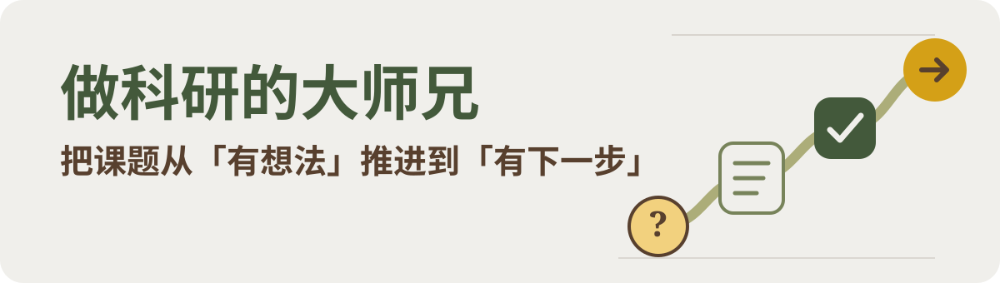

<p align="center">
  
</p>

<p align="center">
  面向研究生的中文科研思路 Skills。先判断哪一步最可能改变判断，再决定下一项值得做的工作。
</p>

<p align="center">
  <code>研究生友好</code>
  <code>中文科研</code>
  <code>生物医学 / 生信</code>
  <code>从问题到下一步</code>
</p>

## 为什么做这套 Skills

这套 Skills 是在真实科研项目推进中逐步写出来的。科研卡住时，问题往往出在文献、结果和可选的下一步太多，很难判断哪一项能改变判断。一次结果比较中，两张结果图实际重复，第一版比较指标也没有回答原来的问题，图中文字还发生重叠；这些问题都是逐项核对后才暴露出来。另一次面对一组无序候选清单时，固定的前 N 名方案可能过早排除有其他证据支持的候选。

所以我把自己的默认思路流写成了这套 Skills，从当前卡点和已有证据出发，找到最值得回答的问题，再决定继续推进、调整方法、缩小目标，还是停下一项低信息增益的工作。

## 先从当前卡点开始

`meta-research-hub` 是总入口。你可以直接告诉它课题进到哪一步、手里有哪些证据、现在难在哪里，以及时间和资源有什么限制。无需先整理成完整方案。

这套思路可以贯穿想课题、规划分析、设计图表和修改论文，作为科研工作的默认思路流。

它会先定位当前最需要回答的问题，再从 13 个核心 Skills 中选择适合的思路。每次建议都会落到四件事。会得到什么产出，会影响哪个判断，下一步怎么走，以及什么情况下可以继续、调整、缩小目标、转向或停下。

## 你会得到什么

- 一项现在最值得先回答的问题
- 已有证据能支持什么，缺口在哪里
- 下一项具体工作，以及完成时应看到什么
- 不同结果对应的继续、调整、缩小目标、转向或停止条件

> 当前问题 → 已有证据 → 关键判断 → 下一步

## 13 个核心 Skills

复杂问题从 [`meta-research-hub`](./skills/meta-research-hub/) 开始。问题已经明确时，可以进入对应的专业 Skill；不需要把 13 个 Skill 从头到尾依次使用。

### 发现与定题

- [`research-entry`](./skills/research-entry/) 适合刚开始做科研，帮助你区分问题、观察和证据，确定第一段可执行的学习路径。
- [`literature-mining`](./skills/literature-mining/) 学习高质量论文怎样发现新问题、怎样建立证据，并从已知边界中寻找可核验的 GAP；不把别人结论直接搬成自己的课题。
- [`topic-convergence`](./skills/topic-convergence/) 把宽泛方向、候选或矛盾结果缩小成具体科学问题。
- [`innovation-judgment`](./skills/innovation-judgment/) 核对已知边界、实质重合和创新空间，帮助判断继续推进还是调整方向。

### 假设与验证

- [`hypothesis-construction`](./skills/hypothesis-construction/) 把观察和候选关系写成可证伪假设，列出竞争解释与判别预测。
- [`mechanism-design`](./skills/mechanism-design/) 在表型或明确候选出现后，设计能区分竞争解释的机制验证方案。
- [`causality-rescue`](./skills/causality-rescue/) 校准相关、必要、充分、中介和直接作用等因果 claim 的表达强度。
- [`pre-experiment-design`](./skills/pre-experiment-design/) 用规模可控的预实验尽早判断候选或方法是否值得继续投入，并给出继续、调整或停止信号。

### 写作与交付

- [`grant-and-opening`](./skills/grant-and-opening/) 把科学问题、前期证据、目标和风险写成开题或标书方案。
- [`sci-writing-and-revision`](./skills/sci-writing-and-revision/) 理清论文主线、Figure 的证据顺序、正文结构和审稿回复。
- [`review-writing`](./skills/review-writing/) 搭建综述框架，区分文献结论、作者综合和待验证问题。
- [`thesis-and-defense`](./skills/thesis-and-defense/) 围绕真实研究工作整理学位论文、外审和答辩材料。

### 投入与停止

- [`research-mindset`](./skills/research-mindset/) 把矛盾结果、有限资源和迟迟未收敛的问题转成投入排序、停止标准和下一步决定。

## 30 秒开始

先安装 `meta-research-hub`，再按问题需要安装专业 Skill。把你的课题和难题说清楚，也可以复制下面这段再补充信息。

```text
请用 meta-research-hub 协助我把这件事往前推进。

课题或工作阶段：
[在这里补充]

已有证据和已经做过的工作：
[在这里补充]

当前卡点：
[在这里补充]

时间、样本、数据和分析资源限制：
[在这里补充]

请先说明：
1. 现在最值得回答的问题是什么；
2. 已有证据支持什么，关键缺口在哪里；
3. 下一步会产生什么产出，改变哪个判断；
4. 不同结果分别对应继续、调整、缩小目标、转向或停止。

文献和高质量论文请优先用于寻找 GAP，学习问题怎样被发现、证据怎样建立。
方法请优先选择高质量论文中常见、审稿人熟悉、适合当前数据并服务主线的方案，
不要先用过度防御的统计细节拖慢推进。
探索阶段可以调整方法、参数或展示来寻找线索，但请保留关键选择，
区分探索性结果与确认性结论，不制造信号，也不隐藏决定性反证。
```

<details>
<summary><strong>三个常见场景怎么问</strong></summary>

### 从文献找 GAP

```text
我有一个大方向，但还没有具体课题。
请先重建高质量论文中的问题怎样被发现、怎样一步步建立证据和留下未解之处，
再结合我的方向寻找可以核验的候选问题。
不要把论文已有结论直接当成我的研究答案。
```

### 结果互相矛盾或不显著

```text
我的不同分析得到了相反方向的结果，或者当前结果没有达到预期。
请先判断哪一个问题最可能改变课题主线，再给出最值得先做的一项复核。
如果有必要调整方法或参数，请说明它是探索性判断还是确认性证据。
```

### 论文不知道什么时候该停

```text
我的主要结果已经齐全，但论文还在反复修改。
请先整理核心 claim 和 Figure 的证据顺序，再按对结论的影响决定补充工作先后。
请明确哪些补充会改变结论，哪些只会增加细节，并给出可以停止的标准。
```

</details>

## 方法原则

- **先从自己的问题和证据出发。** 文献用于学习问题怎样被发现、证据怎样一步步建立，并划定已知边界；项目自己的候选和结论需要自己的证据支撑。
- **方法服务科学问题、论文主线和可发表性。** 优先选择高质量论文中常见、审稿人熟悉、适合当前数据并能回答问题的方法。包括 CNS 正刊和大子刊在内，只要有合理的高质量论文先例，就可以作为基本背书，不让期刊标准变成束缚，也不让过度防御拖住课题。
- **探索可以积极，结论需要和证据相称。** 可以根据数据特征调整方法、参数、阈值、分组或展示来寻找有意义的阳性线索；偶然出现的阳性结果也可以成为值得追查的线索。保留关键选择，区分探索性发现和确认性证据。不制造结果，不隐藏决定性反证，也不把相关性写成因果。
- **有限预算先投入能改变判断的工作。** 每项工作都要说清楚预期产出、会影响什么、完成时应看到什么，以及什么情况下可以继续、调整或停下。

## 使用边界

这套 Skills 用来整理科研问题、证据与下一步。它不能代替真实实验、实验平台 SOP、伦理审批、临床诊疗、正式统计审查，也不能保证论文发表。

涉及代码、正式数据分析、图表制作或实验执行时，请使用相应的专业工具。本系列负责让这些工作围绕清楚的问题、证据和主线展开。

---

<p align="center">
  现在就从一句话开始<br />
  <strong>我现在卡在……，手里有……，想先判断……</strong>
</p>
