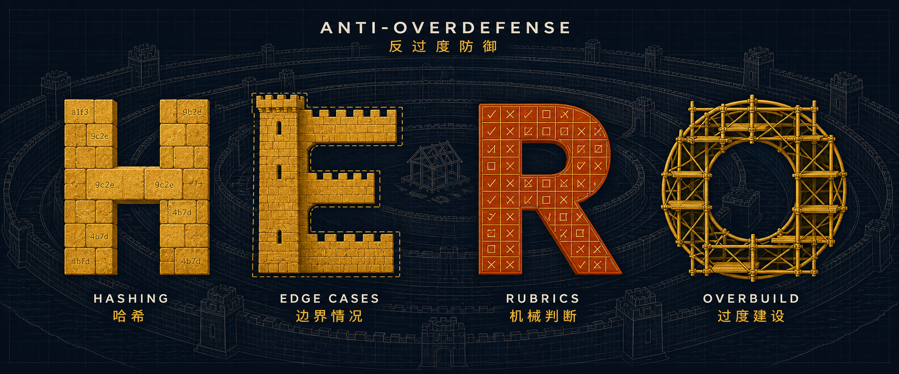

<p align="center">
  
</p>

<p align="center">
  <a href="https://github.com/wanshuiyin/Auto-claude-code-research-in-sleep">
    
  </a>
</p>

# HERO — Anti-OverDefense 🧱

[](LICENSE) · [](README_CN.md) · [](cases/README.md) · [](RULES.md) · [](https://github.com/wanshuiyin/Auto-claude-code-research-in-sleep)

<div align="center">

### 🧱 You asked for a feature. It built a fortress around the feature, and never got to the feature.

***你让它写个功能,它给你造了座堡垒,然后功能一直没写完。***

</div>

The shapes look like an agent optimising for *not being blamed* rather than for
*the work being good* — a hypothesis that fits what we observed, not an
established account of how these models are trained. Either way the shapes are
real, there are four of them, and their initials are the name: **H**ashing,
**E**dge cases, **R**ubrics, **O**verbuild. Naming them makes it possible to say
*which one just happened* instead of arguing about vibes.

This repository is a short block you paste into your agent's config, plus a
catalogue of the behaviours it is meant to stop. It works with **Claude Code**,
**Codex**, **Antigravity**, **Cursor**, **GitHub Copilot**, **Windsurf** and
**Gemini CLI** — anything that loads a config file without being asked. There is
nothing to install.

> 🧬 *Generalised out of [ARIS](https://github.com/wanshuiyin/Auto-claude-code-research-in-sleep) (~13.7k★), whose cross-model reviewer is genuinely good — and also spent a measurable share of its output proposing hashes nobody reads. HERO keeps the value and drops the tax.*

---

## 🧭 What's inside

| | |
|---|---|
| **[`RULES.md`](RULES.md)** | The contract, in English and Chinese, plus the three places the line is genuinely hard to draw. |
| **[`cases/`](cases/README.md)** | Observed behaviours: what was asked, what the agent did, why it is disproportionate, what proportionate looks like. **You do not paste this in** — it is what you quote back when the agent argues. |
| **[`hosts/`](hosts/README.md)** | Where to paste it — Claude Code, Codex, Antigravity, Copilot, Cursor, Windsurf, Gemini CLI. |
| **[`examples/`](examples/)** | Optional, and not part of HERO. Real `AGENTS.md` / `CLAUDE.md` files contributors wrote for **their own projects** and shared so you can see how they adapted the ideas. Not HERO variants, and not the [short version](RULES.md#the-short-version) — their thresholds are theirs. Borrow the approach, not the file. |

---

## 📢 What's changed

Only things that change what you should do. Not rewording, not layout — a
changelog of everything buries the one line that mattered.

- **2026-08-12** —  ⏳ **The block fades on long runs.** Three causes, different answers: something more specific is contradicting it (repeating won't help), it is still there but buried under hours of output (repeating helps), or compaction thinned it (re-emitting helps). Don't set an hourly timer — context grows with work, not with minutes. [How to tell which](RULES.md#what-this-does-not-do) · [hook route](hosts/README.md).
- **2026-08-11** —  📓 **Two cases from long-running quant research** ([#1](https://github.com/wanshuiyin/HERO-Anti-OverDefense/pull/1), thanks [@leisurexhx](https://github.com/leisurexhx)). `HERO-R-006` — audit loops that ate the experiment they were auditing. `HERO-O-005` — a permanent version tree for every recoverable failure. The best line is in neither: a general "only do the checks you need" lost to a twelve-stage workflow in the *same prompt*.
- **2026-08-11** —  🧱 **The block changed — re-paste it.** New rule 6: this never overrides security or migration work you actually asked for. Eight examples added, two of them marked `✓` meaning *report this, don't dismiss it*. There is also a [short version](RULES.md#the-short-version) at half the size.
- **2026-08-11** —  🧱 **HERO published.**

> ⚠️ **Pasted the block before any of the above? Yours is stale.** The install
> command won't fix it — the guard that stops it appending twice also stops it
> replacing. Delete your old `=== SCOPE LIMITS ... ===` section and run it again.

---

## 🚀 Quickstart

Paste this into the file your agent loads automatically — `CLAUDE.md`,
`AGENTS.md`, `.github/copilot-instructions.md`, `.cursorrules`. See
[`hosts/`](hosts/README.md) for the full table.

```
=== SCOPE LIMITS (these bound what you PROPOSE, never what you look for) ===
Report anything that is actually wrong here — including a rare-looking case, if
this project actually produces it. Then keep the fix in scope:
1. This is not a security paper. Verification is welcome; over-defense is not.
   Unless this project states otherwise, assume a cooperating operator on their
   own machine; if it has a real adversary, it will say so and that scope wins.
2. Do not add hashes, checksums or fingerprints unless the hash replaces a
   materially more expensive operation AND its result changes what happens next.
3. No defensive scaffolding: no feature flags, migration frameworks, compat
   layers or wrappers for cases that do not occur here.
4. No corner-case obsession: exotic encodings, symlink races, RTL text and
   millisecond races are out of scope unless the case is reachable through this
   project's supported use — its documented inputs, its published interface, its
   real data. Reachable is enough; you do not need a reproduction. Constructible
   in principle is not enough.
5. Where judgement is needed, judge. Do not replace it with a scoring table, a
   checklist, or a re-verification loop over something already settled.
6. None of this overrides security, migration, verification or review that the
   user, this project's own conventions, or a higher-priority rule asked for.
   Those were requested; they are the work, not scope creep.
Shapes already seen, for calibration. Examples, not a checklist — a real finding
is not dismissed by resembling one:
  H  hashing every row of two spreadsheets to answer what comparing cells answers
  H  writing checksum files that nothing ever reads
  E  hardening the accounts of an app that has no users and no deployment
  R  auditing your own patch all night while the feature stays unwritten
  R  a reviewer that returns a failing verdict on everything
  O  guards whose justification is the previous guard, not the requirement
And two that look like the above and are not. Report these:
  ✓  a digest that lets you skip re-reading a large file you already have
  ✓  a rare-looking input this project's own documentation example produces
Before running any check, answer: what specific failure would this detect, and
what would I do differently if it occurred? No answer means do not run it.
Say plainly when something is correct. Do not manufacture findings.
```

Or in one command. It **appends** to `CLAUDE.md` and leaves whatever is already
there untouched; run it twice and the second run does nothing:

```bash
grep -qi 'scope.limits' CLAUDE.md 2>/dev/null || { printf '\n\n'; curl -sL \
  https://raw.githubusercontent.com/wanshuiyin/HERO-Anti-OverDefense/main/RULES.md \
  | awk '/^=== SCOPE LIMITS/,/^Say plainly when something is correct/'; } >> CLAUDE.md
```

Swap the filename for your host — `AGENTS.md` for Codex and Antigravity,
`.github/copilot-instructions.md` for Copilot; see [`hosts/`](hosts/README.md).
For the Chinese block see the [Chinese README](README_CN.md#-快速开始) — both the
`grep` guard and the `awk` range have to change together, and changing only one
of them costs you the protection against running it twice.

It reads `RULES.md` instead of shipping a second copy, so there is nothing here
that can fall out of sync with the contract. It only ever appends — no temp
file, no overwrite — so the worst it can do to a file you already have is add a
block at the end.

**Too long for your config?** There is a [short version](RULES.md#the-short-version)
— same six rules, no worked examples, about half the size. The examples are what
does the calibrating, so take the full block if you have the room.

**That is the whole install.** There is no setting that points at
[`cases/`](cases/README.md) and nothing else to configure — the catalogue is not
loaded by your agent, [on purpose](cases/README.md#how-to-use-this). It is what
*you* quote back, by ID, when the agent insists some hardening is necessary.

⚠️ **Put it where it is always loaded.** An invoked copy still works when you
invoke it — but it is absent exactly on the long unattended runs, where nobody is
there to invoke it and where this failure costs you a night.

---

## 🔤 The four families

### 🔐 H — Hashing

Checksums, fingerprints and digests added where nothing reads them.

A hash earns its place when it **replaces a materially more expensive operation**
*and* its result changes what happens next. Comparing a digest to avoid pulling
an unchanged large file back into context is a real saving. Hashing every row of
a spreadsheet to answer what ordinary cell comparison already answers is not —
and note that the second one *does* read its hashes, which is why "something
reads it" is too weak a test.

### 🧊 E — Edge cases

Defending inputs that do not occur **here**.

That word is the entire rule. A rare-sounding case this project actually produces
is a real bug and must be reported. A hostile actor who never visits is not.

### 📋 R — Rubrics

Judgement replaced by machinery — scoring tables, checklists, re-verification
loops over something already settled.

The characteristic symptom: a night of work, a complete audit trail, and no
feature.

### 🏗️ O — Overbuild

Scaffolding, feature flags, migration frameworks and compatibility layers built
for a future nobody asked for. Guards guarding guards.

### 🪞 Sibling: over-correction

Point out one flaw and the agent reverses the whole direction; say it went
slightly east and it relocates to the Atlantic. Same root, different symptom,
and none of the four letters fits it — so it is catalogued **outside** HERO.
Blurring the taxonomy is how a case catalogue stops being useful.

---

## 🎯 Why this exists

Asked to diagnose itself, the model put it better than we did:

> My own failure mode here is turning "could improve confidence" into "therefore
> must be built and checked." That silently promotes optional uncertainty
> reduction into the main task.

That is the whole disease in two sentences. Optional uncertainty reduction is
infinite; the task is not.

---

## ⚖️ What it bounds — and what it must never suppress

**These limits bound the fix, never the search.** Getting this backwards makes
the contract actively harmful.

One of the defects that motivated this repository was a scheduler that hung
because a dependency written as a bare string, where a list was expected, got
iterated character by character. That sounds like a rare input-shape edge case —
except the project's **own documentation example** used the bare-string form, so
every user following the docs produced it.

> The test is not *how rare does this sound*. It is **does this happen here**.

The same cut separates a smoke test from test theatre. A smoke test is not
over-defense; it is the cheapest contact with reality, and skipping it is how the
worst bugs survive. Another defect in the same repository killed every training
job at its first sixty-second poll and then looped forever — it shipped because
the code had never been run once end to end, while carrying detailed prose about
its own state machine.

So the rule is not "test less". It is the question in the block: *what specific
failure would this detect, and what would I do differently?* A one-line change
followed by the full suite cannot answer it. A first job surviving its first
poll, when the polling code is exactly what is under suspicion, answers it
immediately.

---

## ⚠️ Honest limitations

**It helps; it is not a switch.** Asked in the original community discussion
whether writing these rules into a markdown file actually works, the most-agreed
answer was *"it helps a little"*. That is the right expectation. Some runs will
still fortify.

**The model can decline.** There are reports of the agent replying that where
these instructions conflict with a higher-priority system constraint, the system
constraint still wins. This *is* configuration — but configuration by defeasible
natural-language instruction, which a stronger instruction can override, not
enforcement.

**Model choice is also a lever.** Several reports describe switching to a
different or earlier model and the problem simply going away. If a task is
especially sensitive to this failure, that may be more direct than any prompt.

**This is not about making the agent do less work.** Every rule here is about
spending the work on the thing that was asked for. The catalogue exists so that
"that's over-defense" is a claim you can check against a specific recognisable
shape — not a way to wave away a finding you would rather not deal with.

---

## 🤝 Contributing

A useful entry has four fields: **what was asked**, **what the agent did**, **why
that is disproportionate**, **what proportionate looks like**. The last one is
the one that matters — a catalogue of complaints without remedies is a wall, not
a resource.

Counterexamples are wanted too. Four entries exist precisely because a flat
reading of the rules would have been wrong — a hash that pays for itself, a
rare-looking bug the project's own docs produced, a smoke run that was owed, and
a broad regression run whose whole point was not knowing what would break.

No usernames, no quoted complaints, no attribution — what matters is the shape,
not who hit it.

---

## 🧩 Works with

**Claude Code · Codex · Antigravity · Cursor · GitHub Copilot · Windsurf · Gemini CLI**
— and anything else that loads a config file without being asked.

There is nothing to install and no version to track. The block is plain text in
whichever file your agent loads without being asked, so a host this list has
never heard of works the same way. Codex and Antigravity both read `AGENTS.md`,
so one file serves both. See [`hosts/`](hosts/README.md) for the exact filename
each one loads and where to put the block inside it.

If you run a second model as a reviewer, give it the block too — a reviewer told
to be adversarial, handed repository access and asked to propose fixes, is the
single most productive source of the behaviour catalogued here.

---

## 💬 Community

Join the WeChat group (shared with the [ARIS](https://github.com/wanshuiyin/Auto-claude-code-research-in-sleep)
community) to compare notes on where your agent over-defends:

<p align="center">
  
</p>

*(The group QR rotates weekly — if it's expired, open an issue and we'll post a fresh one.)*

---

## 🔭 Related projects

- **[ARIS](https://github.com/wanshuiyin/Auto-claude-code-research-in-sleep)** — overnight autonomous ML research via cross-model adversarial review. A version of this contract ships inside its reviewer prompts.
- **[Anti-Autoresearch](https://github.com/wanshuiyin/Anti-Autoresearch)** — the same method pointed at research integrity: observe real failures, name them as families, ship a contract.

---

## 📖 License

MIT.
